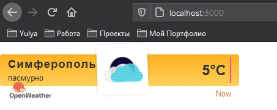
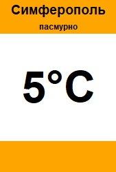

МИНИСТЕРСТВО НАУКИ  И ВЫСШЕГО ОБРАЗОВАНИЯ РОССИЙСКОЙ ФЕДЕРАЦИИ 
Федеральное государственное автономное образовательное учреждение высшего образования 
"КРЫМСКИЙ ФЕДЕРАЛЬНЫЙ УНИВЕРСИТЕТ им. В. И. ВЕРНАДСКОГО" 
ФИЗИКО-ТЕХНИЧЕСКИЙ ИНСТИТУТ 
Кафедра компьютерной инженерии и моделирования

 
<h3 align="center">Отчёт по лабораторной работе № 1  по дисциплине "Программирование"</h3>
  

студента 1 курса группы ИВТ-б-о-201(2) 
Волошинская Юлия Евгеньевна 
направления подготовки 09.03.01 "Информатика и вычислительная техника"

  
<table>
<tr><td>Научный руководитель  старший преподаватель кафедры  компьютерной инженерии и моделирования</td>
<td>(оценка)</td>
<td>Чабанов В.В.</td>
</tr>
</table>
  

Симферополь, 2020

# Лабораторная работа №1

## Цель работы

1. Закрепить навыки разработки многофайловыx приложений;
2. Изучить способы работы с API web-сервиса;
3. Изучить процесс сериализации/десериализации данных в/из json;
4. Получить базовое представление о сетевом взаимодействии приложений;

## Постановка задачи

Разработать сервис предоставляющий данные о погоде в городе Симферополе на момент запроса.  В качестве источника данных о погоде используйте: 
http://openweathermap.org/. В состав сервиса входит: серверное приложение на языке С++ и клиентское приложение на языке Python.

Серверное приложение (далее Сервер) предназначенное для обслуживания клиентских приложений и минимизации количества запросов к сервису openweathermap.org. Сервер должен обеспечивать возможность получения данных в формате JSON и виде html виджета (для вставки виджета на страницу будет использоваться iframe).

Клиентское приложение должно иметь графический интерфейс отображающий сведения о погоде и возможность обновления данных по требованию пользователя.

## Выполнение работы

Перед началом выполнения работя, я ознакомилась со структурой http-запроса, узнала из каких частей он состоит, посмотрела необходимые видеоролики.

1. Для получения API Key я зарегистрировалась на сайте http://openweathermap.org/. После регистрации в разделе API Keys я сгенерировала свой API key. После чего я изучила самые разнообразные способы использования API key http://openweathermap.org/appid#use. Далее я составила и протестировала запрос в браузере, в ответ я получила текст в формате JSON.

Сервер /data/2.5/forecast не предоставляет почасовую информацию о погоде, но зато можно по /data/2.5/forecast?id=693805 , где 693805 - является id города Симферополя получить данные о широте и долготе Симферополя. Эти данные мы можем использовать для формирования почасового отчета по другому пути ресурса "/data/2.5/onecall?lat=44.9572&lon=34.1108, де lat и lon - долгота и широта для Симферополя.
Полный первый запрос: http://api.openweathermap.org/data/2.5/forecast?id=693805&appid=6b2179096d37f4e85bd682f63abd3b67
Полный второй запрос к серверу погоды с получением почасовых данных по Симферополю: http://api.openweathermap.org/data/2.5/onecall?lat=44.9572&lon=34.1108&lang=ru&units=metric&exclude=current,minutely,daily,alerts&appid=6b2179096d37f4e85bd682f63abd3b67

2. Далее я изучила сервис времени worldtimeapi.org, который не требует регистрации и информация от него приходит в формате JSON.
Полный текст запроса к серверу времени: http://worldtimeapi.org/api/timezone/Europe/Simferopol
Из всех данных, присылаемых сервером, нам необходимо только одно поле: ["unixtime"] - текущее время в unix-формате.
Точно такие же подписи времени присутствуют и во всех словарях в почасовом прогнозе погоды. 

3. Для дальнейшей работы нам необходимы дополнительные библиотеки. Я установила две библиотеки для С++ : httplib.h и json.hpp, а также одну библиотеку для Python: requests. 

4. Я ознакомилась с тем, что представляет из себя серверная часть. Она состоит из нескольких подпрограмм: main (тут осуществляется запуск сервера и перехват Get-запросов. Отдельно есть функция запроса к серверу с передачей её аргументов, к какому именно серверу нужно усуществить запрос: погодному или времени. Функция получения и обработки погодных данных, функция обработки данных сервера времени, поисковая функция в кэше данных погоды, функция, формрующая ответ на запрос "/" и функция ответа на запрос "/raw" клиентского приложения. Далее приведен код серверной части приложения.

Рис 1.  Виджет отдаваемый сервером.

<code>
`
#include <iostream>
#include <locale>
#include "cpp_httplib/httplib.h"
#include "nlohmann/json.hpp"
#include <fstream>
#include <stdio.h>
#include <string>

using json = nlohmann::json;
using namespace httplib;

json cash;
int vremya = 0;

int poisk(int time) { //[-1,0,max]
    if (cash.is_null()) { return -1; };
    int index = -1;
    for (int i = 0; i < cash.size(); i++) {
        if (time <= cash["hourly"][i]["dt"].get<int>()) { index = i;  break; }
    }
    return index;
}

//vremya get_vremya()=>> true/false
bool get_vremya() {

    Client vremya_server("http://worldtimeapi.org");
    auto result = vremya_server.Get("/api/timezone/Europe/Simferopol");

    if (result) {
        if (result->status == 200) {
            json worldtime;
            worldtime = json::parse(result->body);
            vremya = worldtime["unixtime"].get<int>();
            return true;
        }
        else std::cout << "Error time server." << result->status << std::endl;
    }
    else {
        auto err = result.error();
        std::cout << "Error code: " << err << std::endl;
    }
    return false;
}

bool get_pogoda() {
    Client pogoda_server("http://api.openweathermap.org");
    auto result = pogoda_server.Get("/data/2.5/onecall?lat=44.9572&lon=34.1108&lang=ru&units=metric&exclude=current,minutely,daily,alerts&appid=6b2179096d37f4e85bd682f63abd3b67");

    if (result) {
        if (result->status == 200) {
            cash = json::parse(result->body);
            return true;
        }
        else std::cout << "Error time server." << result->status << std::endl;
    }
    else {
        auto err = result.error();
        std::cout << "Error code: " << err << std::endl;
    }
    return false;
}

bool raw(const Request& req, Response& res) {

    int now = get_vremya();
    if (!now) { return false; }

    int index = poisk(vremya);
    if (index == -1) {
        if (!get_pogoda()) { return false; }
        index = poisk(vremya);
        if (index == -1) { return false; }
    }
    json reply;
    reply = cash["hourly"][index]["weather"][0];

    reply.push_back({ "temp", cash["hourly"][index]["temp"].get<int>() });

    res.set_content(reply.dump(4), "text/plain");
    return true;
}

bool root(const Request& req, Response& res) {
    int now = get_vremya();
    if (!now) { return false; }

    int index = poisk(vremya);
    if (index == -1) {
        if (!get_pogoda()) { return false; }
        index = poisk(vremya);
        if (index == -1) { return false; }
    }

    std::string wiget_file_name = R"(iframe.html)";

    std::ifstream InFile(wiget_file_name);
    std::string all_line;

    if (InFile.is_open()) {
        getline(InFile, all_line, '\0');
        InFile.close();
    }
    else { return false; }

    std::string srch = "{hourly[i].temp}";
    std::size_t position = all_line.find(srch);
    if (position != std::string::npos)
    {
        all_line.replace(position, srch.size(), std::to_string(cash["hourly"][index]["temp"].get<int>()));
    }

    srch = "{hourly[i].weather[0].icon}";
    position = all_line.find(srch);
    if (position != std::string::npos)
    {
        all_line.replace(position, srch.size(), cash["hourly"][index]["weather"][0]["icon"].get<std::string>());
    }

    srch = "{hourly[i].weather[0].description}";
    position = all_line.find(srch);
    if (position != std::string::npos)
    {
        all_line.replace(position, srch.size(), cash["hourly"][index]["weather"][0]["description"].get<std::string>());
    }

    res.set_content(all_line, "text/html");
    return true;
}

int main() {
    setlocale(LC_ALL, "Russian");

    Server svr;
    svr.Get("/raw", raw);
    svr.Get("/", root);

    std::cout << "Weather server started\n";

    svr.listen("localhost", 3000);
    return 0;
}
`
</code>

 
5. Далее я принялась за создание клиентского приложения. Весь функционал и алгоритм работы Клиента был выполнен. Можно посмотреть на получившийся результат, а также взглянуть на написанный код.

Рис.2 Баннер Клиента после получения данных

<code>
`
from tkinter import *
import requests
import json

def RefreshData(r):
    error=False
    ret={}
    try:
        req = requests.get('http://localhost:3000/raw')
        print(req)
    except:
        error=True
    else:
        if req.status_code!=200:
            print(req.status_code)
            error=True
        else:
            ret = req.json()
            if "temp" not in ret:
                error=True
    if error:
        TownName["text"]="Ошибка"
        Description["text"]="сервер недоступен"
        Temperature["text"]="--°C"
    else:
        TownName["text"]="Симферополь"
        Description["text"]=ret["description"].encode('l1').decode()
        Temperature["text"]=str(int(ret["temp"]))+"°C"

m = Tk()
m.geometry("170x250+300+400")
m.resizable(0, 0)
m.overrideredirect(1)

TownName   =Label(m, text = "", height=1, width=20, bg='orange', font=("Helvetica", 14, 'bold'))
Description=Label(m, text = "", height=1, width=30, bg='orange', font=("Helvetica",  9, 'bold'))
Temperature=Label(m, text = "", height=2, width=10, bg='white' , font=("Helvetica", 48, 'bold'))
LowBlok    =Label(m,            height=3, width=30, bg="orange")

TownName.pack(side=TOP)
Description.pack(side=TOP)
Temperature.pack(side=TOP)
LowBlok.pack(side=BOTTOM)

RefreshData(None)
RefreshData(None)
m.bind("<Button-1>", RefreshData)
mainloop()

`
</code>

6. Я изучила программу ngrok (https://ngrok.com/) и научилась создавать тунели для localhost. Все полученные знания могут пригодитьсь для дальнейшей работы.

## Вывод:
В ходе выполнения лабораторной работы, я изучила большое количество новой информации, котору приминила на практике. Многое было для меня совершенно новым. 