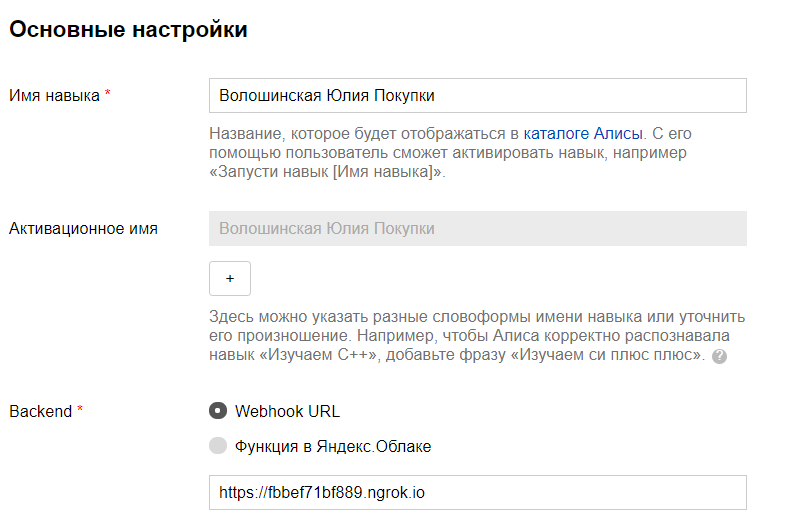
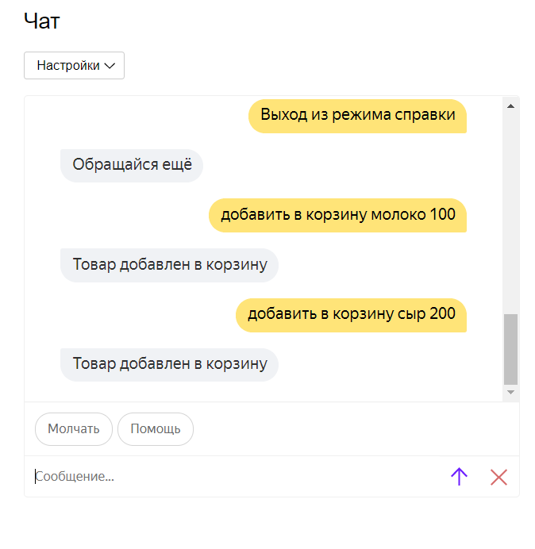
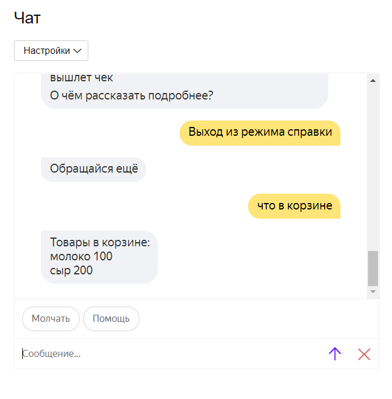

## Программирование
​Автор: Волашинская Юлия
​<br><h3> Первый семестр </h3>
<p align="center">МИНИСТЕРСТВО НАУКИ  И ВЫСШЕГО ОБРАЗОВАНИЯ РОССИЙСКОЙ ФЕДЕРАЦИИ<br>
Федеральное государственное автономное образовательное учреждение высшего образования<br>
"КРЫМСКИЙ ФЕДЕРАЛЬНЫЙ УНИВЕРСИТЕТ им. В. И. ВЕРНАДСКОГО"<br>
ФИЗИКО-ТЕХНИЧЕСКИЙ ИНСТИТУТ<br>
Кафедра компьютерной инженерии и моделирования</p>
<br>
<h3 align="center">Отчёт по лабораторной работе № 2<br> по дисциплине "Программирование"</h3>
<br><br>
<p>студента 1 курса группы ИВТ-б-о-201(2)<br>
Волошинской Юлии Евгеньевной<br>
направления подготовки 09.03.01 "Информатика и вычислительная техника"</p>
<br><br>
<table>
<tr><td>Научный руководитель<br> старший преподаватель кафедры<br> компьютерной инженерии и моделирования</td>
<td>(&nbsp;&nbsp;&nbsp;&nbsp;&nbsp;&nbsp;&nbsp;&nbsp;&nbsp;&nbsp;&nbsp;&nbsp;&nbsp;&nbsp;&nbsp;&nbsp;&nbsp;&nbsp;&nbsp;&nbsp;&nbsp;&nbsp;&nbsp;&nbsp;&nbsp;&nbsp;&nbsp;&nbsp;&nbsp;&nbsp;&nbsp;&nbsp;)</td>
<td>Чабанов В.В.</td>
</tr>
</table>
<br><br>
<p align="center" > Симферополь, 2020</p>
<hr>


<h1>Лабораторная работа №2 Алиса</h1>
   
<h2>Цель работы:</h2>
<ul>
<li>Получить представления о структуре post-запроса;</li>
<li>Изучить webhooks как метод взаимодействия web-приложений;</li>
</ul>

<h2>Постановка задачи</h2>

<ul>
<li>Разработайте и зарегистрируйте навык для Алисы на сервисе ЯндексюДиалоги;</li>
<li>В качестве backend-a для навыка реализуйте приложение на языке С++ выполняющее следующие функции:</li>
<ul>
<li>Составление продуктовой корзины:</li>
<ul>
<li>Добавление продукта в корзину;</li>
<li>Удаление продукта из корзины;</li>
<li>Очистка корзины;</li>
<li>Вывод списка товаров в корзине;</li>
<li>Подсчёт стоимости товаров в корзине.</li>
</ul>
<li>Вывод справочной информации по навыку;</li>
<li>Регистрацию webhook-ов сторонних сервисов;</li>
<li>Отправку данных на сторонние сервисы. </li>
</ul>
<li>В качестве стороннего сервиса реализуйте приложение на языке Python выполняющее следующие функции:</li>
<ul>
<li>Ожидание данных о покупке;</li>
<li>Сохранение поступивших данных в excel-документ.</li>
</ul>
</ul>
Далее указаны все подробности.
<p>&nbsp;&nbsp;&nbsp;&nbsp;</p><br>&nbsp;&nbsp;&nbsp;&nbsp;

<h2>Ход работы</h2>

<p>&nbsp;&nbsp;&nbsp;&nbsp;Я зарегистрировала на ресурсе Яндекс.Диалоги новый диалог c названием "Волошинская Юлия Покупки". Также я провела все нужные нам настройки и, конечно,  подключила к нему тунель ngrok.</p>
<p align="center"></p>
<p align="center">Рис 1. Помощь по командам.</p>

<p>&nbsp;&nbsp;&nbsp;&nbsp;Для начала я изучила как принцип работы Webhook, а после узнала как с его помощью взаимодействовать с Яндекс-Алисой. В приложении можно найти детальный список ответов от сервиса и список всех необходимых для работы с ним полей.
Далее мне необходимо было написать программный код на с++ для работы с сервисом. Это одна из самых сложных частей работы.</p>

<p>&nbsp;&nbsp;&nbsp;&nbsp;Хочется сказать, что серверный код обслуживает также добавление webhook-ов. Он осуществляет это через post-запросы.</p>

<p>&nbsp;&nbsp;&nbsp;&nbsp;Далее предоставлен результат.</p>

<p align="center"></p>
<p align="center">Рис 2. Демонстрация работы кода.</p>

<p align="center"></p>
<p align="center">Рис 3. Что находится в корзине.</p>


<p>&nbsp;&nbsp;&nbsp;&nbsp;Далее предоставлен полный текст серверного приложения (с++):</p>


```c++
#include <iostream>
#include <cpp_httplib/httplib.h>
#include <nlohmann/json.hpp>
#include <string>
#include <iostream>
#include <fstream>
#include <vector>

using namespace httplib;
using namespace std;
using json = nlohmann::json;

json config;    // конфигурация webhook
json korzinka;  // корзина товаров
json tovar;     // один товар.
json reply;     // ответ для Алисы
json body;      // ответ от Алисы

string user_id;     // понятно
string session_id;  // сессия
bool mute = false;  // режим для глухонемой Алисы
bool help = false;  // окно помощи активно, заказы не принимаем
json new_button = json::parse(u8R"({ "title": " ", "hide" : true })");

void clean_korzinka() {
    korzinka = json::parse(u8R"( { "user_id": "", "check" : [] })");
    korzinka["user_id"] = user_id;
}
void clean_tovar() {
    tovar = json::parse(u8R"({ "item": "", 
                                "price" : 0 })");
}
void clean_reply() {
    reply = json::parse(u8R"({ "response": { 
                                                "text": " ", 
                                                "tts": " ", 
                                                "buttons": [],
                                                "end_session": false }, 
                                                "version": "1.0"})");
    vector<string> btn;
    if (help) {
        btn = { u8"Выход из режима справки",
                u8"Молчать",
                u8"Говорить",
                u8"Помощь",
                u8"Что в корзине",
                u8"Очистить корзину",
                u8"Сумма",
                u8"Добавить в корзину",
                u8"Убрать из корзины",
                u8"Покупка завершена" };
    }
    else { btn = { u8"Молчать", u8"Говорить", u8"Помощь" }; }

    json button = new_button;
    for (int i = 0; i < btn.size(); i++) {
        if ((mute && btn[i] == u8"Молчать") || (!mute && btn[i] == u8"Говорить")) continue;
        button = new_button;
        button["title"] = btn[i];
        reply["response"]["buttons"].push_back(button);
        //cout << i << reply.dump(2) << "\n\n\n=========\n\n";
    }

}

bool SendWebhooks(json& basket, string site) {
    string url;
    string dir;
    size_t index = site.find("//");
    if (index == string::npos) {  // сайт введен без https://
        index = site.find("/");
        index = 0;
    }
    else { index += 2; }

    index = site.find("/", index);

    if (index == string::npos) {     // без dir
        url = site; dir = string("/");
    }
    else {
        url = site.substr(0, index);
        dir = site.substr(index);
    }

    cout << "   > url: " << url << " dir: " << dir << " ... ";

    Client cli(url.c_str());
    auto cli_res = cli.Post(dir.c_str(), basket.dump(), "application/json");

    if (cli_res) { // Проверяем статус ответа, т.к. может быть 404 и другие
        if (cli_res->status == 200) {
            cout << " ok\n";   // В res->body лежит string с ответом сервера
            return true;
        }
        else  std::cout << "Status code: " << cli_res->status << std::endl;
    }
    else { auto err = cli_res.error();  std::cout << "Error code: " << err << std::endl; }
    return false;
}

string token_add(int cnt) {
    if (body["request"]["nlu"]["tokens"].size() < cnt) return "";
    string rep = "";
    for (int i = 0; i < cnt; i++) {
        rep += body["request"]["nlu"]["tokens"][i].get<string>() + " ";
    }
    rep.erase(rep.size() - 1, 1);
    return rep;
}

void error() {
    reply["response"]["text"] = u8"Команда не опознана";
    reply["response"]["tts"] = u8"Команда не опознана";
}

void analize() {
    clean_reply();

    if (empty(body["session"]["user"]["user_id"])) {
        user_id = "anonymous";
        korzinka["user_id"] = "anonymous";
    }
    else {
        user_id = body["session"]["user"]["user_id"];
        korzinka["user_id"] = body["session"]["user"]["user_id"];
    }

    if (body["session"]["new"]) {
        reply["response"]["text"] = u8"Здравствуйте! Я помогу вам с покупками.";
        reply["response"]["tts"] = u8"Здравствуйте! Я помогу вам с покупками.";
        clean_korzinka();
        korzinka["user_id"] = user_id;
        return;
    }

    string g = token_add(1);

    if (u8"ping" == token_add(1)) {
        if (body["request"]["nlu"]["tokens"].size() > 1) { error(); return; } // мусор после команды
        reply["response"]["text"] = u8"Сервис работает";
        reply["response"]["tts"] = u8"Сервис работает";
        return;
    }

    if (u8"очистить корзину" == token_add(2)) {
        if (body["request"]["nlu"]["tokens"].size() > 2) { error(); return; } // мусор после команды
        if (!help) {

            clean_korzinka();
            if (help) {
                reply["response"]["text"] = u8"Так можно очистить всю корзину";
                reply["response"]["tts"] = u8"Так можно очистить всю корзину";
                return;
            }
            else {
                reply["response"]["text"] = u8"Корзина пуста";
                reply["response"]["tts"] = u8"Корзина пуста";
                return;
            }

        }
        else {
            reply["response"]["text"] = u8"Так можно очистить всю корзину";
            reply["response"]["tts"] = u8"Так можно очистить всю корзину";
            return;
        }

    }

    if (u8"добавить в корзину" == token_add(3)) {
        if (help && body["request"]["nlu"]["tokens"].size() > 3) { error(); return; } // нет названия товара

        if (!help) {
            int price = 0;
            int price_pos = 0;
            string good_name = "";
            for (int i = 0; i < body["request"]["nlu"]["entities"].size(); i++) {
                if (body["request"]["nlu"]["entities"][i]["type"] == "YANDEX.NUMBER") {
                    price = body["request"]["nlu"]["entities"][i]["value"];
                    price_pos = body["request"]["nlu"]["entities"][i]["tokens"]["start"];
                    break;
                }
            }

            if (price <= 0) { error(); return; }          // если не ввели цену или цена отрицательная
            if (price_pos == 3) { error(); return; }    // нету названия товара
            for (int i = 3; i < price_pos; i++) { good_name += body["request"]["nlu"]["tokens"][i].get<string>() + " "; }
            good_name.erase(good_name.size() - 1, 1); // убираем пробел в конце названия товара

            if (body["request"]["nlu"]["tokens"].size() > price_pos + 2) { error(); return; } // слишком много токенов после цены

            // проверка является ли токен, который стоит за ценой обозначением валюты?
            if (body["request"]["nlu"]["tokens"].size() > price_pos + 1) {
                string currency = body["request"]["nlu"]["tokens"][price_pos + 1].get<string>();
                if (currency != u8"р" && currency != u8"руб" && currency != u8"рублей") { error(); return; } // ошибочная валюта
            }

            // всё нормально, добавляем товар
            clean_tovar();
            tovar["item"] = good_name;
            tovar["price"] = price;
            korzinka["check"].push_back(tovar);

            reply["response"]["text"] = u8"Товар добавлен в корзину";
            reply["response"]["tts"] = u8"Товар добавлен в корзину";
            return;
        }
        else {
            reply["response"]["text"] = u8"С помощью этой команды можно добавить товар в корзину";
            reply["response"]["tts"] = u8"С помощью этой команды можно добавить товар в корзину";
            return;
        }

    }

    if (u8"убрать из корзины" == token_add(3)) {
        if (!help && body["request"]["nlu"]["tokens"].size() < 4) { error(); return; } // нет названия товара
        if (help && body["request"]["nlu"]["tokens"].size() > 3) { error(); return; } // нет названия товара

        if (!help) {
            string good_name = "";
            for (unsigned i = 3; i < body["request"]["nlu"]["tokens"].size(); i++) {
                good_name += body["request"]["nlu"]["tokens"][i].get<string>() + " ";
            }
            good_name.erase(good_name.size() - 1, 1); // убираем пробел в конце названия товара

            if (korzinka["check"].size() == 0) { // если корзинка пуста
                reply["response"]["text"] = u8"В корзине ничего нет";
                reply["response"]["tts"] = u8"В корзине ничего нет";
                return;
            }

            // ищем такой товар в корзинке
            bool found = false;
            for (unsigned i = 0; i < korzinka["check"].size(); i++) {
                if (korzinka["check"][i]["item"].get<string>() == good_name) {
                    korzinka["check"].erase(i);
                    found = true;
                }
            }
            if (found) {
                reply["response"]["text"] = u8"ОК";
                reply["response"]["tts"] = u8"ОК";
                return;
            }
            reply["response"]["text"] = u8"Такого товара нет в корзине";
            reply["response"]["tts"] = u8"Такого товара нет в корзине";
            return;
        }
        else {
            reply["response"]["text"] = u8"Эта команду уберёт товар из корзины";
            reply["response"]["tts"] = u8"Эта команду уберёт товар из корзины";
            return;
        }


    }

    if (u8"что в корзине" == token_add(3)) {
        if (body["request"]["nlu"]["tokens"].size() > 3) { error(); return; } // есть какой-то мусор после команды

        if (!help) {

            if (korzinka["check"].size() == 0) {
                reply["response"]["text"] = u8"Корзина пуста";
                reply["response"]["tts"] = u8"Корзина пуста";
                return;
            }

            string rep = u8"Товары в корзине:\n";
            for (unsigned i = 0; i < korzinka["check"].size(); i++) {
                rep += korzinka["check"][i]["item"].get<string>() + " ";
                rep += to_string(korzinka["check"][i]["price"].get<int>()) + "\n";
            }
            reply["response"]["text"] = rep;
            reply["response"]["tts"] = rep;
            return;
        }
        else {
            reply["response"]["text"] = u8"Так можно посмотреть, что у Вас в корзине";
            reply["response"]["tts"] = u8"Так можно посмотреть, что у Вас в корзине";
            return;
        }
    }

    if (u8"сумма" == token_add(1)) {
        if (body["request"]["nlu"]["tokens"].size() > 1) { error(); return; } // есть какой-то мусор после команды
        if (!help) {
            int summa = 0;
            for (unsigned i = 0; i < korzinka["check"].size(); i++) {
                summa += korzinka["check"][i]["price"].get<int>();
            }
            reply["response"]["text"] = u8"Сумма:\n" + to_string(summa) + "\n";
            reply["response"]["tts"] = u8"Сумма:\n" + to_string(summa) + "\n";
            return;
        }
        else {
            reply["response"]["text"] = u8"Эта команда подсчитает стоимость Ваших покупок";
            reply["response"]["tts"] = u8"Эта команда подсчитает стоимость Ваших покупок";
            return;
        }
    }

    if (u8"покупка завершена" == token_add(2)) {
        if (body["request"]["nlu"]["tokens"].size() > 2) { error(); return; } // есть какой-то мусор после команды

        if (!help) {
            for (int i = 0; i < config["webhooks"].size(); i++) {
                string webhook_url = config["webhooks"][i].get<string>();
                SendWebhooks(korzinka, webhook_url);
            }
            reply["response"]["end_session"] = true;
            reply["response"]["text"] = u8"Заходите ещё";
            reply["response"]["tts"] = u8"Заходите ещё";
            return;
        }
        else {
            reply["response"]["text"] = u8"Завершит сессию и отправит Ваши заказы на сервер";
            reply["response"]["tts"] = u8"Завершит сессию и отправит Ваши заказы на сервер";
            return;
        }
    }

    if (u8"молчать" == token_add(1)) {
        if (body["request"]["nlu"]["tokens"].size() > 1) { error(); return; } // есть какой-то мусор после команды

        if (!help) {

            if (!mute) { // если говорит ещё
                mute = true;
                clean_reply();
                reply["response"]["text"] = u8"Молчу, молчу";
                reply["response"]["tts"] = u8"Молчу, молчу";
                return;
            }
            else {
                reply["response"]["text"] = u8"Я и так молчу";
                reply["response"]["tts"] = u8"Я и так молчу";
                return;
            }
        }
        else {
            reply["response"]["text"] = u8"Так можно заставить меня замолчать";
            reply["response"]["tts"] = u8"Так можно заставить меня замолчать";
            return;
        }
    }

    if (u8"говорить" == token_add(1)) {
        if (body["request"]["nlu"]["tokens"].size() > 1) { error(); return; } // есть какой-то мусор после команды

        if (!help) {
            if (mute) { // если говорит ещё
                mute = false;
                clean_reply();
                reply["response"]["text"] = u8"Хорошо";
                reply["response"]["tts"] = u8"Хорошо";
                return;
            }
            else {
                reply["response"]["text"] = u8"Я и так говорю";
                reply["response"]["tts"] = u8"Я и так говорю";
                return;
            }
        }
        else {
            reply["response"]["text"] = u8"Так можно заставить меня говорить";
            reply["response"]["tts"] = u8"Так можно заставить меня говорить";
            return;
        }
    }

    if (u8"помощь" == token_add(1)) {
        if (body["request"]["nlu"]["tokens"].size() > 1) { error(); return; } // есть какой-то мусор после команды

        if (help) { // уже в режиме помощи
            reply["response"]["text"] = u8"Эта команда выведет список подсказок";
            reply["response"]["tts"] = u8"Эта команда выведет список подсказок";
            return;
        }
        else { // перейти в режим помощи
            help = true;
            clean_reply();
            reply["response"]["text"] = u8R"(Помощь поможет разобраться с командами\n\nМолчать и Говорить - включают и отключают голос\n\nКорзина - поможет организовать покупки\n\nДобавить в корзину - добавить товар в корзину\n\nЧто в корзине - выведет список заказов\n\nУбрать из корзины - уберет товар из корзины\n\nСумма - покажет общую сумму заказа\n\nПокупка завершена - завершит покупку и вышлет чек\n\nО чём рассказать подробнее?)";
            reply["response"]["tts"] = u8R"(Помощь поможет разобраться с командами\n\nМолчать и Говорить - включают и отключают голос\n\nКорзина - поможет организовать покупки\n\nДобавить в корзину - добавить товар в корзину\n\nЧто в корзине - выведет список заказов\n\nУбрать из корзины - уберет товар из корзины\n\nСумма - покажет общую сумму заказа\n\nПокупка завершена - завершит покупку и вышлет чек\n\nО чём рассказать подробнее?)";
            return;
        }
    }

    if (u8"выход из режима справки" == token_add(4)) {
        if (body["request"]["nlu"]["tokens"].size() > 4) { error(); return; } // есть какой-то мусор после команды

        if (help) { // если в режиме помощи
            help = false;
            clean_reply();
            reply["response"]["text"] = u8"Обращайся ещё";
            reply["response"]["tts"] = u8"Обращайся ещё";
            return;
        }
    }

    error();
    return;
}

void gen_response(const Request& req, Response& res) {

    body = json::parse(req.body.c_str());

    analize();
    if (mute) { reply["response"]["tts"] = "sil <[500]>"; }

    res.set_content(reply.dump(), "text/json; charset=UTF-8");
}

void gen_responseWebhook(const Request& req, Response& res) {

    if (req.method == "POST" && req.has_param("del")) {
        auto remove_site = req.get_param_value("del");
        for (int i = 0; i < config["webhooks"].size(); i++)  // если пришло удаление, ищем название 
        {                                                    // сата для удаления в config
            if (config["webhooks"][i] == remove_site) {
                config["webhooks"].erase(i);                // стираем его
                break;                                      // выходи - два файла не приходят
            }
            ofstream config_file_new("webhook.json");           // открываем файл для записи
            config_file_new << config;                          // записываем туда конфиг
            config_file_new.close();                            // закрываем файл после записи в него
        }
    }
    else if (req.method == "POST" && req.has_param("set")) {     // надо новый сайт добавить
        auto add_site = req.get_param_value("set");
        config["webhooks"].push_back(add_site);              // добавляем его в конец
        ofstream config_file_new("webhook.json");            // открываем файл для записи
        config_file_new << config;                           // записываем туда конфиг
        config_file_new.close();                             // закрываем файл после записи в него
    }

    ifstream webhookHTML("webhookHTML.html");
    if (!webhookHTML.is_open()) {
        cout << "Ошибка!! webhookHTML.html не найден.\n"; return;
    }

    string webhookHTML_data;
    std::getline(webhookHTML, webhookHTML_data, '\0');  // читаем файл как одну строку, целиком
    webhookHTML.close();                                // закрываем считанный шаблонный файл
    string sites;                                       // тут будем делать вставку сайтов

    for (int i = 0; i < config["webhooks"].size(); i++) {
        sites.append(u8R"(<div class = "form-row align-items-center"><div class = "col"><input type = "text" value = ")").append(config["webhooks"][i]).append(u8R"(" class = "form-control mb-2" disabled></div><div class = "col"><button type = "submit" name = "del" value = ")").append(config["webhooks"][i]).append(u8R"(" class = "btn btn-danger mb-2">Удалить</button></div></div>)");
    }

    webhookHTML_data.replace(webhookHTML_data.find("{webhooks_list}"), size("{webhooks_list}"), sites);
    res.set_content(webhookHTML_data, "text/html; charset=UTF-8");  // ответ на Get запрос
}

int main() {

    ifstream config_file("webhook.json");
    if (!config_file.is_open())
    {
        json config = json::parse(R"({"webhooks": []})");  // создаём новый json конфиг
        ofstream config_file_new("webhook.json");            // открываем файл для записи
        config_file_new << config;                          // записываем туда новый конфиг
        config_file_new.close();                            // закрываем файл после записи в него
    }
    else {                      // если всё в порядке и нашелся конфиг на диске, 
        config_file >> config;  // читаем его
        config_file.close();    // закрываем файл после чтения
    }


    // запускаем сервер
    Server svr;
    svr.Post("/", gen_response);             // сюда присылает Алиса
    svr.Post("/webhooks", gen_responseWebhook); // сюда приходят и Post и Get запросы для редактирования
    svr.Get("/webhooks", gen_responseWebhook);  // конфига webhook
    std::cout << "Start server... OK\n";

    svr.listen("localhost", 3000);         // Запускаем сервер
}

```


<p>&nbsp;&nbsp;&nbsp;&nbsp;Далее предоставлен полный текст серверного приложения (python):</p>  

```python
from openpyxl import Workbook
from openpyxl import load_workbook
from flask import Flask, request
import json
import datetime

file      = 'data_julia.xlsx'
cash      = []
cash_size = 5

app = Flask(__name__)
@app.route('/', methods=['POST'])
def index():
    global cash_size, file, cash

    data = request.json

    for msg in data['check']:
        cash.append( [data['user_id'],
                        str(datetime.datetime.now()),
                        msg['item'],
                        msg['price']
                        ])
    if len(cash) >= cash_size:
        try:
            w_book  = load_workbook(file)
            w_sheet = w_book.active
            w_book.save(file)
            w_book.close()

        except FileNotFoundError:
            w_book = Workbook()
            w_sheet = w_book.active
            w_sheet.append(['N', 'User ID', 'Date time', 'Item', 'Price'])
            w_book.save(file)

        except Exception as e:
            print('Произошла ошибка!', e)
            return "Ok"

        w_book = load_workbook(file)
        w_sheet = w_book.active

        last_raw = w_sheet.max_row

        for new_raw in cash:
            new_raw=[last_raw]+new_raw
            w_sheet.append(new_raw)
            last_raw+=1
        w_book.save(file)
        w_book.close()
        cash=[]

    return "Ok"

if __name__ == "__main__":
    app.run()

```

<h2>Вывод</h2>
<p>&nbsp;&nbsp;&nbsp;&nbsp;В ходе выполнения данной лабораторной работы я ознакомилась с огромным количеством новой информации. Я применила полученную информацию на практике, что позволило лучше разобраться в данной теме. Пришлось ознакомиться с новыми интересными и нужными технологиями. </p>

