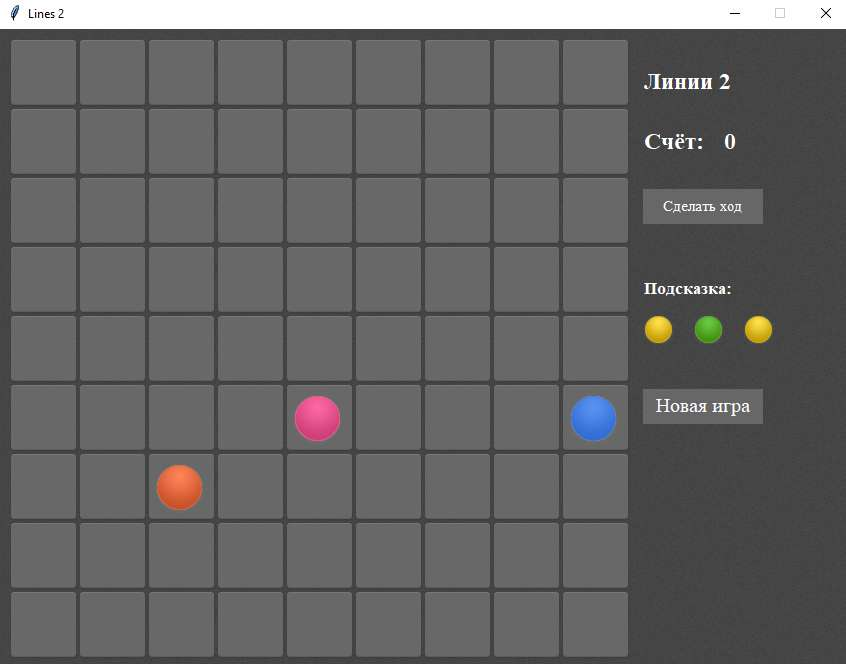
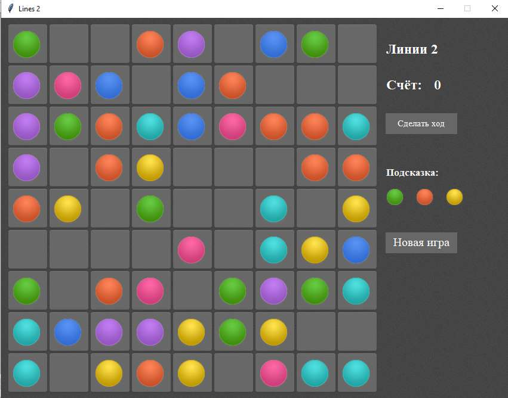
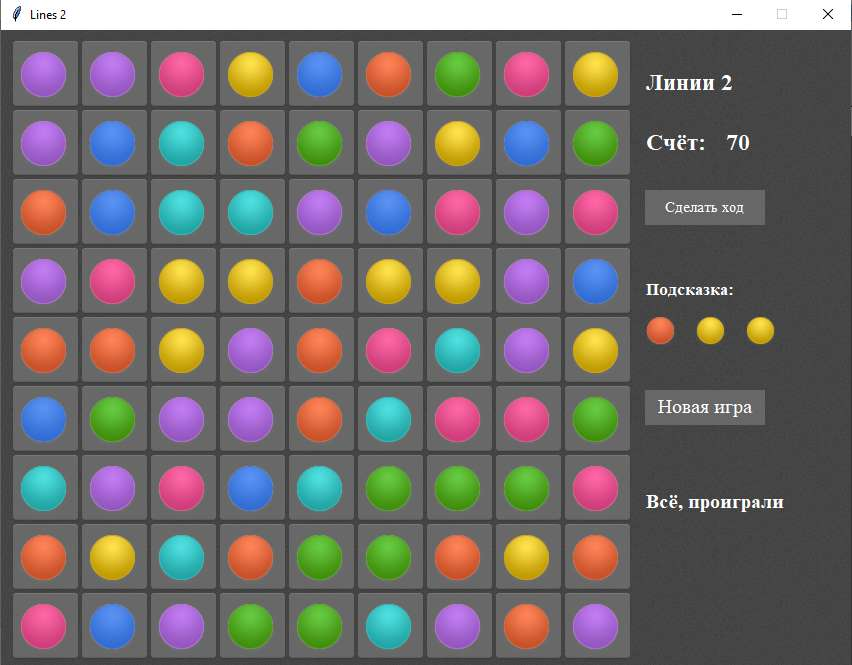

## Программирование
​Автор: Волошинская Юлия
​<br><h3> Первый семестр </h3>
<p align="center">МИНИСТЕРСТВО НАУКИ  И ВЫСШЕГО ОБРАЗОВАНИЯ РОССИЙСКОЙ ФЕДЕРАЦИИ<br>
Федеральное государственное автономное образовательное учреждение высшего образования<br>
"КРЫМСКИЙ ФЕДЕРАЛЬНЫЙ УНИВЕРСИТЕТ им. В. И. ВЕРНАДСКОГО"<br>
ФИЗИКО-ТЕХНИЧЕСКИЙ ИНСТИТУТ<br>
Кафедра компьютерной инженерии и моделирования</p>
<br>
<h3 align="center">Отчёт по лабораторной работе № 3<br> по дисциплине "Программирование"</h3>
<br><br>
<p>студента 1 курса группы ИВТ-б-о-201(2)<br>
Волошинской Юлии Евгеньевны<br>
направления подготовки 09.03.01 "Информатика и вычислительная техника"</p>
<br><br>
<table>
<tr><td>Научный руководитель<br> старший преподаватель кафедры<br> компьютерной инженерии и моделирования</td>
<td>(&nbsp;&nbsp;&nbsp;&nbsp;&nbsp;&nbsp;&nbsp;&nbsp;&nbsp;&nbsp;&nbsp;&nbsp;&nbsp;&nbsp;&nbsp;&nbsp;&nbsp;&nbsp;&nbsp;&nbsp;&nbsp;&nbsp;&nbsp;&nbsp;&nbsp;&nbsp;&nbsp;&nbsp;&nbsp;&nbsp;&nbsp;&nbsp;)</td>
<td>Чабанов В.В.</td>
</tr>
</table>
<br><br>
<p align="center" > Симферополь, 2021</p>
<hr>
   
<h2>Цель работы</h2> 
<p>&nbsp;&nbsp;&nbsp;&nbsp;Закрепить навыки разработки программ с простым графическим интерфейсом пользователя на языке Python при помощи библиотеки Tkinter; Получить представление о разработке простых игровых приложений.<br>

<h2>Постановка задачи</h2>

Используя стандартный модуль для разработки программ с графическим интерфейсом Tkinter, реализуйте игру Lines на языке Python.
В качестве образца графического интерфейса была использована данная игра.
Подробности указаны далее.

<h2>Ход работы</h2>

<h3>0. Изучение предоставленных материалов.</h3>

В первую очередь я ознакомилась с материалами по графическому интерфейсу Tkinter и библиотекой Pillow, которая используется для
подготовки и выведения графики из графических файлов (png) на виджеты Tkinter. Очень помогли пердоставленные научным руководителем готовые
элементы кода, где продемонстрировано, как совмещать картинки разных размеров. Это, мне показалось, самым сложным моментом во всей работе.

Далее я изучила описанную логику игры и перешла по ссылке, чтобы ознакомиться с предоставленным образцом игры.

<h3>I. Подготовка.</h3>
Я установила библиотеку Pillow и протестировала несколько простых примеров работы с графикой, прочитала руководство по размещению элементов с
помощью метода .grid() и нарисовала для себя схему, как примерно размещать элементы в окошке Tkinter.

<h3>II. Выполнение работы.</h3>

<h4>1. Расположение элементов оформления.</h4>
С установкой элементов при помощи метода .grid() почти ничего не получалось, но потом я прочитала, что есть ещё метод .place(), который позволяет
устанавливать виджеты в произвольное место на экране. С этим методом работа пошла быстрее, т.к. все виджеты ставились куда нужно.
Я воспользовалась разрешением не делать анимацию передвижения и появления шаров. Так что для создания всей графики мне нужны были только
самые большие шары.
По представленным примерам я нарезала большие шары из всех файлов с шарами и подготовила графический комплект для выполнения игры:
двумерный массив img[][], где первым индексом идёт цвет шара (0-пустая клетка), а второй индекс указывает на: 0-большой шар с обычной клеткой,
1-большой шар с помеченной клеткой (для выбора шара) и 3-пришлось ещё вырезать маленькие шары и наложить на них фон окна - они нужны для
отображения подсказки справа. Итого получилось 21 картинка + пустое поле и всё это в массиве img. 
Потом я создала поле: двумерный массив pole[y][x] и заполнила его картинками с пустыми клетками. Для каждого виджета я ещё добавила два
дополнительных атрибута: .cord - координаты, где стоит шар и .color - цвет шара (0-если нет шара).

Дополнительно я сделала массив из тёх элементов для виджетов подсказки. Всё примерно так же, как и с виджетами для pole, только картинки туда шли
маленькие из индекса 2 массива img[color][2].

Когда поле стало нормално отображаться, я попробовала разместить методом .place надписи справа, но они при изменении текста центровались
и было некрасиво и неровно. Поэтому я попробовала разместить справа элемент canvas, на котором просто нарисовала текст в нужном мне месте.
Честно говоря на оформление поля и размещение всех элементов ушла большая часть времени. Но и опыт был получен большой.

<p align="center"></p>
<p align="center">Рис 1. Самое начало игры.</p>

<h4>2. Логика игры.</h4>
Я сделала основные функции игры: для приёма кликов по клеткам поля - pole_click(), перезапуск игры - restart_game(), конец игры - end_game(),
добавление трёх новых шаров - balls_add() из шаров подсказки, генерацию трёх новых шаров подсказки - generate_hlp() и ещё несколько других.
Логика игры сводится к тому, что мы сначала рисуем поле, потом заполняем буфер шаров помощи и идёт игра.

<p align="center"></p>
<p align="center">Рис 2. Почти заполненное поле.</p>

В игре есть две фазы: игра идёт и проигрыш - игра ждёт нажатия кнопки "Новая игра". Если при появлении новых шаров места для них уже нет, то
игра переходит из стадии игры в стадию ожидания и выводит надпись о проигрыше. Именно наличие этой надписи я и сделала флагом состояния игры:
если надписи нет, игра идёт, если есть - ждёт. Получился вполне рабочий вариант.

<p align="center"></p>
<p align="center">Рис 3. Проигрыш. Игра в фазе ожидания.</p>

Важным моментом игры было определить, если возможность перекатить шар на другую позицию. Для этого я использовала рекурсивный алгоритм путепоиска,
когда из каждой новой клетки появляются ещё другие клетки. Есть общий set() занятых позиций на поле и алгоритм постоянно добавляет в этот сет данные о том,
что ещё теперь уже занято. Такой алгоритм работает достаточно быстро, но, увы, не возвращает пути, по которому он от начала поиска добрался до его конца.
Может быть я его переделаю немного позже.

Второй важный алгоритм это алгоритм поиска образовавшихся линий после переката шара - line_check(point). Подробно я его расписал в комментария в коде игры.
Скажу лишь, что он работает по принципу 4-х направлений: горизонтальная, вертикальная и две диагональные линии. Заведомо, сначала
изменяет координаты поиска так, чтобы они находились за пределами поля, чтобы обязательно захватить все клетки поля. И потом изменяет
коорбинаты поиска в направлении своего вектора. Все шары по каждому из направлений собираются отдельно и поэтому потом
можно удалить сразу все линии, например, если шар "закрыл" сразу две или три линии. Это так же как в представленном образце игры.

<p><br>Привожу полный код игры "Lines 2":</p>

```python

import random as rnd 
from tkinter import *
from PIL import Image, ImageTk
class pf():
    def __init__(self, lab, start, end):
        self.found=False                    # пока думаем, что прохода нет, попробуем доказать обратное!
        self.end=end
        self.bad = set()                    # сюда будем прятать все несвободные координаты
        for y in range(len(lab)):           #
            self.bad.add((len(lab[y]), y))  # это своеобразныз "забор" по краям лабиринта: правая
            self.bad.add((-1, y))           # и левая стенки, чтоб не "выпасть" за пределы лабиринта
            for x in range(len(lab[y])):
                self.bad.add((x, -1))       # соответственно верхняя стенка
                self.bad.add((x, len(lab))) # и нижняя стенка "забора". Да!! мы их добавляем много раз, но set() нам это простит :)
                if lab[y][x].color:         # если обнаружен шарик (цвет поля НЕ равен 0),
                    self.bad.add((x, y))    # тоже отправляем его в препятствия
        self.path(start)                    # теперь пробуем продраться через препятствия
    def path(self, point):
        if point==self.end:                 # о! путь найден! останавливаем рекурсию
            self.found=True                 # и выходим с победой!
            return
        x,y=point                           # так... работаем по новой точке.
        self.bad.add(point)                 # запихиваем её в уже занятые раз мы уже на ней стоим
        if (x+1,y) not in self.bad: self.path((x+1,y)) # если можно пойти вправо, идём
        if (x-1,y) not in self.bad: self.path((x-1,y)) # влево, делаем тоже самовызов
        if (x,y+1) not in self.bad: self.path((x,y+1)) # вниз и
        if (x,y-1) not in self.bad: self.path((x,y-1)) # вверх

# Главная процедура проверки нажатий на объекты поля: шарики и пустые клетки
def pole_click(event): #event *args, **kargs
    global pole, selected, etap #print(event.widget.cord) .color
    #print(event.widget.cord, event.widget.color, 'Sel:', '-' if not selected else (selected.cord, selected.color) )
    if gameend!="": return          # конец игры. не обрабатываем поле. ждём пока нажмут "Новая игра"

    x,y=event.widget.cord           # получаем координаты клетки, по которой кликнули
    if event.widget.color:          # click по какому-то шару - цвет шара не равен 0 (0-пустая клетка)
        unselest_ball()             # разпомечаем ранее выбранный шар
        pole[y][x].configure(image=img[event.widget.color][1]) # устанавливаем фон с пометкой на клетке с новым шаром
        selected=event.widget;      # сохраняем новый помеченный шар
        return

    if not event.widget.color and not selected: return # click по пустому полю при невыбранном шаре

    # click по пустому полю и есть выбранный шар. пробуем переставить его на это пустое поле
    lab=pf(pole, selected.cord, (x,y))  # вызываем класс поиска пути, чтоб проверить есть ли проход
    if not lab.found: return            # путь на свободную клетку не найден. выходим

    pole[y][x].color = selected.color   # перемещаем шар на новую позицию
    pole[y][x].configure(image=img[selected.color][0]) # и цвет тоже помечаем
    if line_check((x,y), set([pole[selected.cord[1]][selected.cord[0]]])): balls_add()

def update_score(set_score): # обновляем счёт
    global C, score, count
    score=set_score
    C.delete(count)
    count=C.create_text(90,100, text=str(score), anchor=NW, font="Times 17 bold", fill="white")
    C.update()

def line_check(point, also_del=set()): # проверка линий на заполненность после появления любого шара
    global score, pole
    px, py=point # для удобства сохраняем координаты проверяемого поля в новые переменные
    pc=pole[py][px].color # это цвет шара на нём
    balls_to_del=set() # сюда будем склавывать все найденные для удаления шары
    for vect in ((0, 1),(1, 0),(1, 1),(1, -1)): # четыре линии для проверки: |,-,\,/
        cx=px+vect[0]*(-1)*10                   # уходим по обратному вектору точно за пределы поля,
        cy=py+vect[1]*(-1)*10                   # чтобы захватить все клетки линии
        mark=False                              # это флаг для алгоритма поиска. равен True, если мы уже попадали в область поля хоть раз
        line_balls_to_del=set()                 # временнуй контейнер для удаляемых шаров на одной линии
        while (not mark) or (0<=cx<=8 and 0<=cy<=8): # двигаемся по линии пока не дойдём и не пройдём всё поле навылет
            cx+=vect[0]                         # делаем один
            cy+=vect[1]                         # шажок по вектору
            if 0<=cx<=8 and 0<=cy<=8:           # если мы по координатам находимся в зоне поля
                if pole[cy][cx].color==pc:      # да ещё и цвет совпадает с тем, что мы ищем
                    line_balls_to_del.add(pole[cy][cx]) # срочно помечаем, что этот шар нужно убрать
                else:
                    if len(line_balls_to_del)>=5: break # цвет не совпал. хм. может линия закончилась? выходим
                    else:  line_balls_to_del=set() # так. или это дырка или мы ещё вообще ничего не понаходили. чистим контейнер от неполной линии
                mark=True # надо пометить, что мы уже идем по полю и как встретим "не поле", значит поле уже прошли и надо будет выходить
        balls_to_del|=line_balls_to_del if len(line_balls_to_del)>=5 else set() # если нашли что стирать за время прохода по линии, ссыпаем всё в общий контейнер
    update_score(score+2*len(balls_to_del)) # посчитаем, сколько насобирали шариков: по 2 очка за шар. и обновим счёт на экране
    balls_to_del|=also_del # добавим ещё на удаление тот шар, который мы забыли удалить со старого места, когда перекатывали шар на новое
    for i in balls_to_del: # удаляем все ненужные шары
        i.configure(image=img[0][0]) # картинку
        i.color=0                   # и цвет
    return False if len(balls_to_del)>=5 else True # возвращаем True, если ничего не нашли и надо добавить 3 новых шара на поле

def unselest_ball():
    if selected:                                        # уже есть выбранный шар надо отменить выбор
        sx,sy = selected.cord
        pole[sy][sx].configure(image=img[selected.color][0])

def generate_hlp():
    for i in range(3): # наполняем Позсказку случайными маленькими шариками
        hlp[i].color=rnd.randint(1,7)
        hlp[i].configure(image=img[hlp[i].color][2])

def get_free_cells(): # проверка свободного места на поле
    return [pole[y][x].cord for y in range(9) for x in range(9) if not pole[y][x].color]

def balls_add(*args, **kargs):
    unselest_ball() # разпомечаем шар, если был какой-то помечен
    if gameend!="":             return      # если "конец игры", то никаких новых шаров пусть жмёт на Новая Игра
    if len(get_free_cells())<3: end_game()  # ой, место на поле закончилось - игра закончена
    for i in range(3):                      # Выдаём три шара из Помощи
        free=get_free_cells()               # получаем массив свободных мест на поле
        xp,yp=free[rnd.randint(0,len(free)-1)] # выбираем одно случайное свободное место
        pole[yp][xp].color = hlp[i].color                           # и савим туда
        pole[yp][xp].configure(image=img[pole[yp][xp].color][0])    #   шар из Помощи
        line_check((xp,yp)) # может ему повезло и шар попал и сразу закрыл какую-то линию?
    generate_hlp() # генерируем новую Помощь

def end_game():
    global gameend
    C.delete(gameend) # стираем старую надпись (но, вроде, не должно было быть), если была и выводим печальную новую "Всё проиграли"
    gameend=C.create_text(10,460, text='Всё, проиграли', anchor=NW, font="Times 15 bold", fill="white") # это переводит игру в режим ожидания

def restart_game(*args, **kargs):
    global gameend, pole
    update_score(0) # сбрасываем счёт
    if gameend!="": # устанавливаем режим игры в Игра, убираем надпись Вы проиграли
        C.delete(gameend)
        gameend=""
    for y in range(9):      # чистим поле от остатков прошлой игры
        for x in range(9):
            pole[y][x].color=0
            pole[y][x].configure(image=img[0][0])
    unselest_ball() # чистим помеченный шарик, если он был
    generate_hlp()  # генерируем новую помощь
    balls_add()     # выкатываем на поле три новеньких шарика из Помощи

### Переменные игры ###################################################################################
pole=[]         # массив с Label игрового поля
hlp=[]          # массив из 3-х элементов Помощи (в виде виджета сразу - маленькие такие шарики)
selected=None   # тут храним выбранный шарик (в виде виджета сразу)
score=0         # самая важная переменная!
gameend=""      # это место для надписи "Всё, проиграли". Если оно пусто, игра идёт, если нет, значит ждём пока нажмут Новая Игра

root = Tk()                     # создали окно Tkinter
root.title("Lines 2")           # поменяли название в шапке
root.geometry('850x640+200+100')# установили размер окна 850x640 и чтоб при выводе было посередине 200+100
root.resizable(0, 0)            # нельзя менять размеры окна

bgg=ImageTk.PhotoImage(Image.open(r"page-bgr.png")) # фон окна Tkinter
for y in range(5): # застилаем окно серой плиткой
    for x in range(7):
        Label(root, image=bgg, bd=0).place(x=128*x, y=128*y) #сама плитка

C=Canvas(root, width='150', height='640', bd=0, highlightthickness=0, relief='ridge');
C.place(x=635,y=0) # создаём канвас, чтобы нормально на нём писать, всё, что нужно
for y in range(5):
    C.create_image(  0, y*128, image=bgg, anchor=NW) # и внутри канваса укладываем
    C.create_image(128, y*128, image=bgg, anchor=NW) # такую же серую плитку. Почему она серая, а не розовая? :)

C.create_text(10,40, text='Линии 2', anchor=NW, font="Times 17 bold", fill="white") # надписи разные
C.create_text(10,100, text='Счёт:', anchor=NW, font="Times 17 bold", fill="white")
count=C.create_text(90,100, text='10000', anchor=NW, font="Times 17 bold", fill="white") # это место, где мы будем счёт нисать постоянно

b_img=Image.open("btn_bg.png").crop((0,0,120,35)).convert('RGBA') # пришлось для кнопки сделать картинку
bgg_b=ImageTk.PhotoImage(b_img)
NewTurn=Button(root, text="Сделать ход", font="Times 11", highlightthickness=0, bd=0, image=bgg_b, compound='center', fg='white', padx=0, pady=0)
NewTurn.bind("<Button-1>", balls_add)
NewTurn.place(x=644,y=160) # тут понятно

C.create_text(10,250, text='Подсказка:', anchor=NW, font="Times 13 bold", fill="white")
Restart=Button(root, text="Новая игра", font="Times 15", highlightthickness=0, bd=0, image=bgg_b, compound='center',fg='white', padx=0, pady=0)
Restart.bind("<Button-1>", restart_game)
Restart.place(x=644,y=360) # тут тоже. две кнопки сделали

bgg_c   = Image.open("cell-bgr.png") # это всё как делать картинку для шариков и как большую картинку впихивать
empty   = bgg_c.crop((0, 0,69, 69)).convert('RGBA') # в маленькую даже если она плохо впихивается
empty_s = Image.open("page-bgr.png").crop((0,0,35,35)).convert('RGBA') # почти дословно скоприровано из методички
sel     = bgg_c.crop((0,69,69,138)).convert('RGBA')
img=[[ImageTk.PhotoImage(empty), ImageTk.PhotoImage(empty_s)]]
pic_size_same_as_bgr   = Image.new("RGBA", (69,69))
pic_size_same_as_bgr_s = Image.new("RGBA", (35,35))
for ball_file in ['aqua','blue','green','pink','red','violet','yellow']: # список файлов с шариками
    img.append([])
    ball_img=Image.open('ball-'+ball_file+'.png')

    ball=ball_img.crop((0,0,55,57)).convert('RGBA')                         # вырезали первый шар
    ball_over_bgr = Image.alpha_composite(empty, pic_size_same_as_bgr)
    ball_over_bgr.paste(ball, (5,7), ball)
    img[-1].append(ImageTk.PhotoImage(ball_over_bgr)) # img[0] - картинка с непомеченным большим шариком

    ball_over_bgr = Image.alpha_composite(sel, pic_size_same_as_bgr)
    ball_over_bgr.paste(ball, (5,7), ball)
    img[-1].append(ImageTk.PhotoImage(ball_over_bgr))# img[0] - картинка с помеченным большим шариком

    ball=ball_img.crop((13, 57*3+23, 50,57*4)).convert('RGBA')                         # вырезали малый шар
    ball_over_bgr = Image.alpha_composite(empty_s, pic_size_same_as_bgr_s)
    ball_over_bgr.paste(ball, (5,7), ball)
    img[-1].append(ImageTk.PhotoImage(ball_over_bgr))# img[0] - картинка с маленьким шариком для помощи
pole=[] # формитуем игровое поле и проставляем его пустыми клеточками
for y in range(9):
    pole.append([]) # добавляем новый ряд поля
    for x in range(9):
        pole[y].append(Label(root, image = img[0][0], bd=0))
        pole[y][x].bind("<Button-1>", pole_click) # назначаем функцию при клике на поле (любую клетку)
        pole[y][x].cord = (x,y)     # добавляем дополнительный параметр с координатами клетки
        pole[y][x].color = 0        # и её цветом, чтобы можно было понять, куда преподаватель попал мышкой
        pole[y][x].place(x=x*69+10, y=y*69+10) # метод place оказался удачным решением... как же я намучилась с grid и pack до этого!!!!!!!
hlp=[] # формируем масси Label для Помощи
for i in range(3):
    hlp.append(Label(root, image = img[1][-1], bd=0))   # сама Label
    hlp[i].color = 1                                    # первый попавшийся цвет, всё равно сейчас его при генерации новой помощи затрут
    hlp[i].place(x=640+i*50, y=280)                     # ставим всё это справа

generate_hlp()  # а вот и то, о чём я говорила! затираем старые картинки Помощи и генерируем туда случайные
balls_add()     # добавляем на поле три новеньких блестященьких случайноцветных шарика!
root.mainloop() # Поехали!

```

<h2>Вывод</h2>
В ходе выполнения лабораторной работы пришлось очень плотно познакомиться со стандартной графической библиотекой Tkinter и графической библиотекой Pillow.
Эти знания дают теперь возможность при необходимости сделать какой-то простой интерфейс графического приложения для своих нужд или
для какой-то программы. Интересно было попрактиковаться в разработке игрового приложения и поработать с подготовкой графики для него.
Для выполнения работы, кроме материалов, предоставленных научным руководителем, пришлось посмотреть и изучить дополнтельно несколько 
видеокурсов на эти темы. Работа была и интересной, и полезной.
