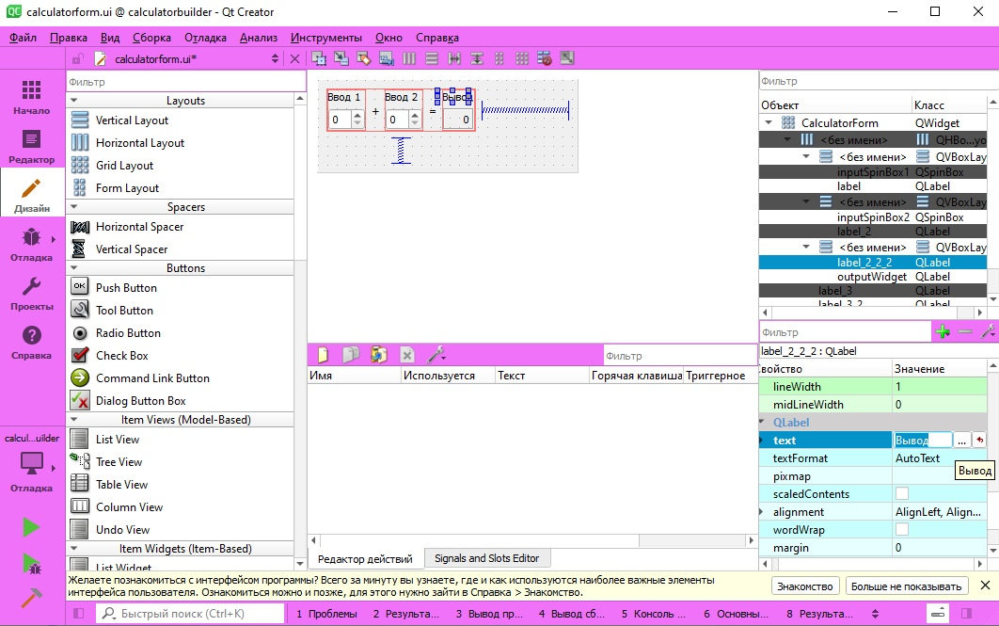
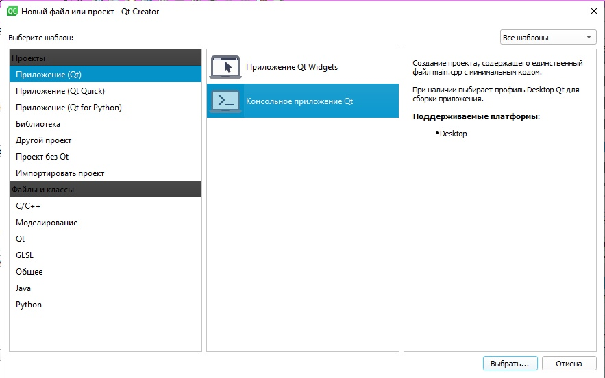
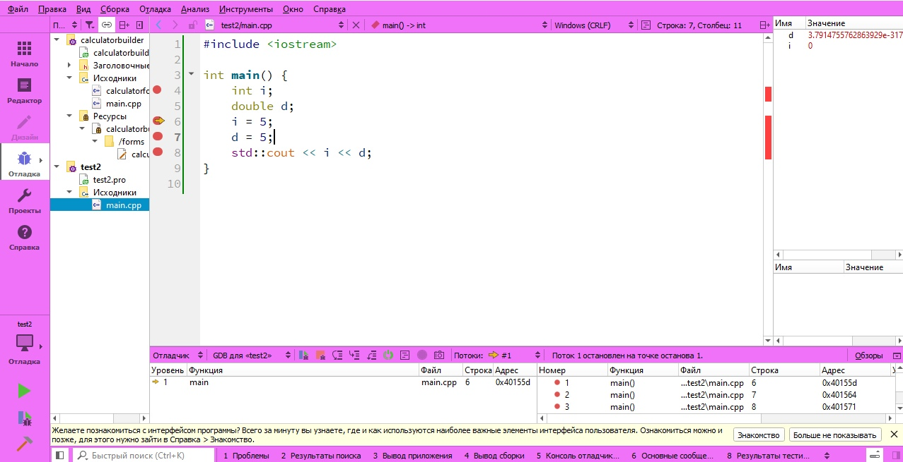

## Программирование
​Автор: Волашинская Юлия
​ <h3> Второй семестр </h3>

МИНИСТЕРСТВО НАУКИ  И ВЫСШЕГО ОБРАЗОВАНИЯ РОССИЙСКОЙ ФЕДЕРАЦИИ 
Федеральное государственное автономное образовательное учреждение высшего образования 
"КРЫМСКИЙ ФЕДЕРАЛЬНЫЙ УНИВЕРСИТЕТ им. В. И. ВЕРНАДСКОГО" 
ФИЗИКО-ТЕХНИЧЕСКИЙ ИНСТИТУТ 
Кафедра компьютерной инженерии и моделирования

 
<h3 align="center">Отчёт по лабораторной работе № 2  по дисциплине "Программирование"</h3>
  

студента 1 курса группы ИВТ-б-о-201(2) 
Волошинской Юлии Евгеньевной 
направления подготовки 09.03.01 "Информатика и вычислительная техника"

  
<table>
<tr><td>Научный руководитель  старший преподаватель кафедры  компьютерной инженерии и моделирования</td>
<td>(&nbsp;&nbsp;&nbsp;&nbsp;&nbsp;&nbsp;&nbsp;&nbsp;&nbsp;&nbsp;&nbsp;&nbsp;&nbsp;&nbsp;&nbsp;&nbsp;&nbsp;&nbsp;&nbsp;&nbsp;&nbsp;&nbsp;&nbsp;&nbsp;&nbsp;&nbsp;&nbsp;&nbsp;&nbsp;&nbsp;&nbsp;&nbsp;)</td>
<td>Чабанов В.В.</td>
</tr>
</table>
  

 Симферополь, 2020

<h1>Лабораторная работа №4 Знакомство с фреймворком Qt </h1>
   
<h2>Цель работы:</h2>
<ul>
<li>Установить фреймворк Qt;</li>
<li>Изучить основные возможности создания и отладки программ в IDE Qt Creator.</li>
</ul>

<h2>Постановка задачи</h2>

<ul>
<li>Настроить рабочее окружение, для разработки программного обеспечения при помощи Qt и IDE Qt Creator, а также изучить базовые возможности данного фреймворка.</li>

<h2>Ход работы</h2>

&nbsp;&nbsp;&nbsp;&nbsp;Спрева я зарегистрировалась на сайте QT и скачала онлайн-инсталлятор, установила QT и запустила пример с калькулятором.

Рис 1. Запуск примера с калькулятором.

&nbsp;&nbsp;&nbsp;&nbsp;Потом создала новый консольный проект.

Рис 2. Новый консольный проект.

&nbsp;&nbsp;&nbsp;&nbsp;Вопрос1: Как изменить цветовую схему (оформление) среды? 

&nbsp;&nbsp;&nbsp;&nbsp;Ответ: Инструменты-Параметры-Интерфейс-Среда-Тема.

&nbsp;&nbsp;&nbsp;&nbsp;Вопрос2: Как закомментировать/раскомментировать блок кода средствами Qt Creator?

&nbsp;&nbsp;&nbsp;&nbsp;Ответ: Правка-Дополнительно-Закомментировать или Ctrl+/

&nbsp;&nbsp;&nbsp;&nbsp;Вопрос3: Как открыть в проводнике Windows папку с проектом средствами Qt Creator?

&nbsp;&nbsp;&nbsp;&nbsp;Ответ: В режиме редактирования клик правой кнопкой мышки на папке - Показать в проводнике

&nbsp;&nbsp;&nbsp;&nbsp;Вопрос4: Какое расширение файла-проекта используется Qt Creator? 

&nbsp;&nbsp;&nbsp;&nbsp;Ответ: pro

&nbsp;&nbsp;&nbsp;&nbsp;Вопрос5: Как запустить код без отладки?

&nbsp;&nbsp;&nbsp;&nbsp;Ответ: Ctrl+r

&nbsp;&nbsp;&nbsp;&nbsp;Вопрос6: Как запустить код в режиме отладки?

&nbsp;&nbsp;&nbsp;&nbsp;Ответ:  F5

&nbsp;&nbsp;&nbsp;&nbsp;Вопрос7: Как установить/убрать точку останова (breakpoint)?

&nbsp;&nbsp;&nbsp;&nbsp;Ответ: Левой кнопкой мышки кликнуть немного левее номера строки.

&nbsp;&nbsp;&nbsp;&nbsp;В новом файле я заменила содержимое файла на предоставленный нам в лабораторной работе код. После я перешла в режим сборки в режим Отладка, установила точки останова на 6, 7, 8 строках, выполнила рограмму в режиме отладки. 

Рис 3. Код программы.

&nbsp;&nbsp;&nbsp;&nbsp;Чему равны переменные i и d в 6 строке? (i=0; d=3.7914755762863929e-317) 

&nbsp;&nbsp;&nbsp;&nbsp;Чему равны переменные i и d в 7 строке? (i=5; d=3.7914755762863929e-317) 

&nbsp;&nbsp;&nbsp;&nbsp;Чему равны переменные i и d в 8 строке? (i=5; d=5) 

&nbsp;&nbsp;&nbsp;&nbsp;Также я обновила файл gitignore, чтобы в репозиторий не попадал всякий мусор.

<h2>Вывод</h2>

&nbsp;&nbsp;&nbsp;&nbsp;В ходе выполнения данной лабораторной работы я ознакомилась с огромным количеством новой информации. Я применила полученную информацию на практике, что позволило лучше разобраться в данной теме. Пришлось ознакомиться с новыми интересными и нужными технологиями. 

